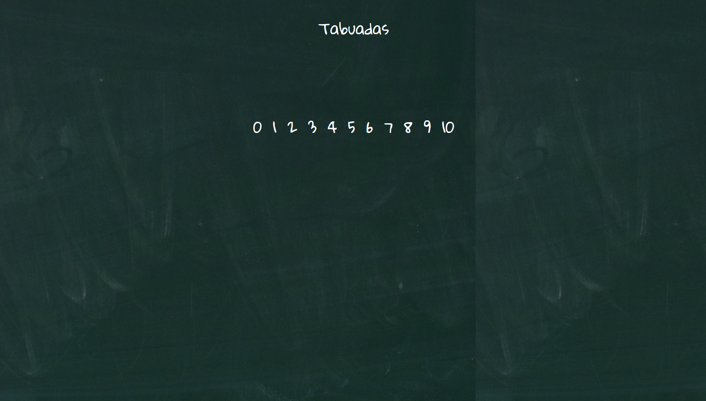
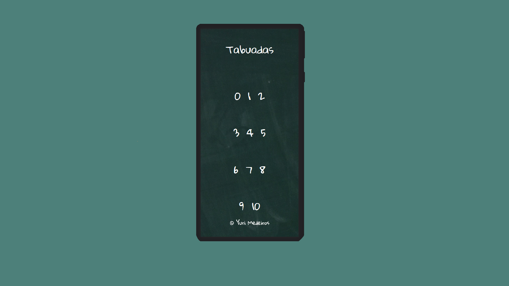

# Table of

### About Table of / Sobre o Table of

The 'table of...' project was developed with the aim of encouraging children to learn mathematics, by displaying multiplication grids (tables) in a stylish way.
 
 
O projeto 'table of...' foi desenvolvido com o objetivo de estimular crianças ao conhecimento matemático, por dispor de forma estilosa as grades de multiplicação(tabuadas)

 
 

> Table of Interface running in a Large Screen/ Interface do Table of(Tabuada de) funcionando em uma tela de alta escala.

> Table of Interface running in a Mobile Screen/ Interface do Table of(Tabuada de) funcionando em um dispositivo móvel.

### Click at link below to see it working! / Clique no link abaixo para vê-lo funcionando!
<a href="https://yurimayk.github.io/TableOf/">Clique aqui!</a>

### Project steps/Etapas do Projeto

The project is not under development. Below are the definitions of performed tasks to finish it:
 
O projeto não está em desenvolvimento. Abaixo estão as definições de tarefas executadas para finalizá-lo:

- [x] Create HTML/Criar estrutura HTML;
- [x] Create CSS/Estilização com CSS;
- [x] Improve responsiveness/Aprimorar responsividade;
- [x] Add JavaScript/Adicionar JavaScript;
- [x] Make the project available online/Disponibilizar o projeto, online;

## 🤝 Contributor/Colaborador

The creator, and developer, of this project:
 
O criador e desenvolvedor deste projeto:

<table>
  <tr>
    <td align="center">
      <a href="#">
         
        
          <a href="https://www.linkedin.com/in/yurimayk/" target="_blank"><b>Yuri Medeiros</b></a>
        
      </a>
    </td>
</table>

[⬆ Voltar ao topo](#nome-do-projeto) 
